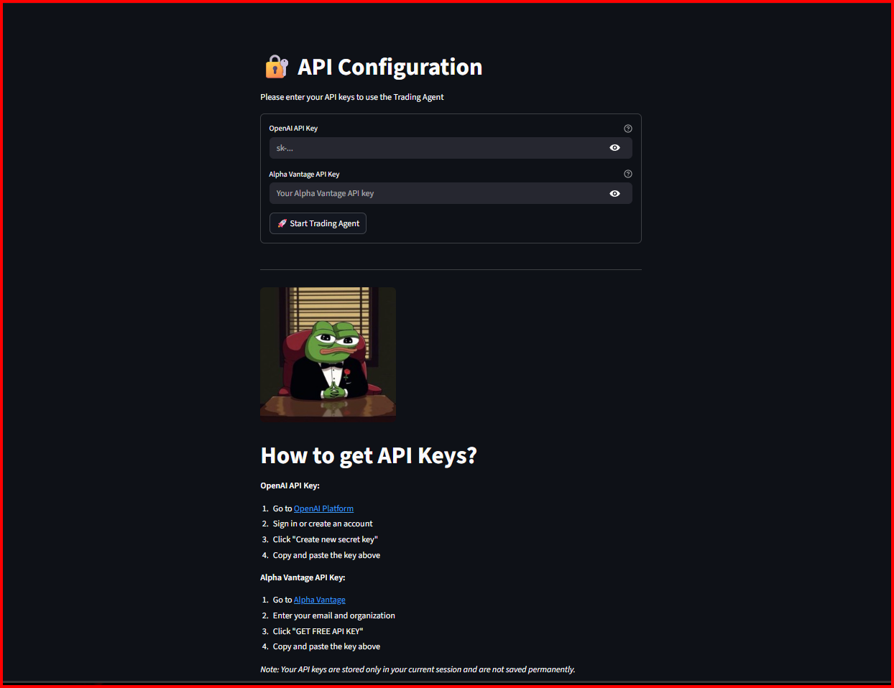
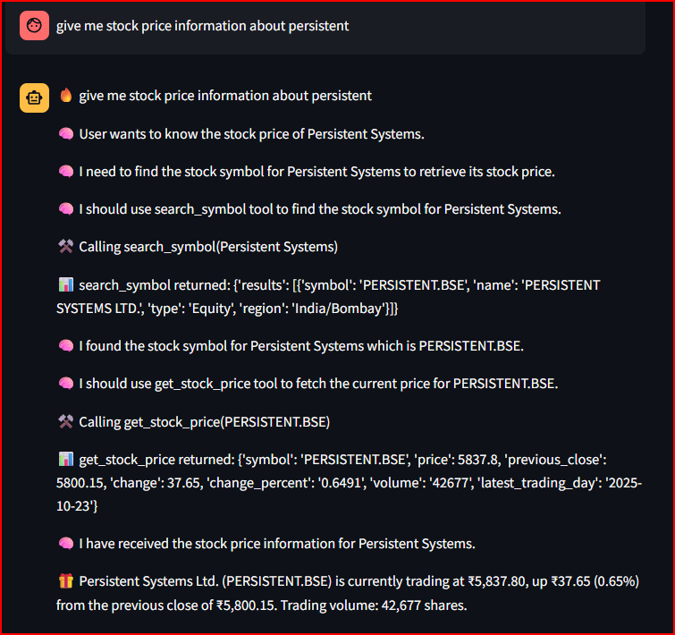
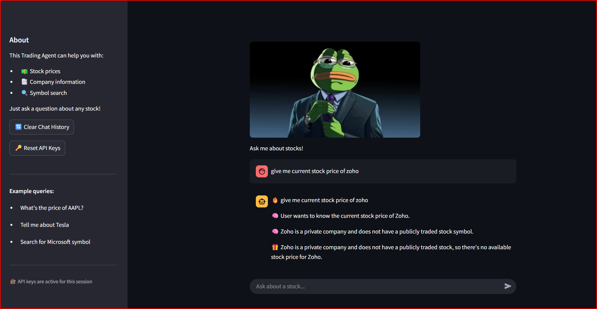

# MarketInsight AI Agent

MarketInsight AI Agent is a streamlined AI agent built with Streamlit that uses Alpha Vantage APIs to provide real-time stock prices, company info, and symbol search, helping users make smarter trading decisions with AI-powered insights and automation.

**[Try it live](https://marketinsight-ai-agent.streamlit.app/)**

## **Features**

### Core Capabilities
- **Stock Price Lookup** - Get real-time prices, changes, volume, and trading data
- **Company Information** - Access sector, industry, market cap, P/E ratio, and business descriptions
- **Symbol Search** - Find stock symbols by company name
- **Chain-of-Thought Reasoning** - Transparent decision-making process showing how the agent plans and executes queries

### Dual Interface
- **CLI Agent** (`agent.py`) - Command-line interface for quick queries
- **Streamlit Web App** (`app.py`) - Interactive web interface with chat history

## **Interface Preview**

### API Configuration

*Configure your OpenAI and Alpha Vantage API keys to get started*

### Stock Information Query

*Example: Getting stock price information with chain-of-thought reasoning*

### Interactive Chat Interface

*Ask questions about any stock in natural language*

**Get your API keys:**
- OpenAI: https://platform.openai.com/api-keys
- Alpha Vantage: https://www.alphavantage.co/support/#api-key (Free)

## **Example Queries**
```
"What's the stock price of AAPL?"
"Tell me about Tesla"
"Find the symbol for Microsoft"
"Compare GOOGL and MSFT"
"What sector is Amazon in?"
```

## **How It Works**

The agent uses a **chain-of-thought reasoning** approach:

1. **START** - Receives and acknowledges user query
2. **PLAN** - Breaks down the task into logical steps
3. **TOOL** - Calls appropriate API functions when needed
4. **OBSERVE** - Processes tool responses
5. **OUTPUT** - Delivers formatted answer to user

Each step is transparent, showing the agent's reasoning process.

## **About the APIs**

### Alpha Vantage API
Alpha Vantage provides free, real-time stock market data for this project. It supplies stock prices, company information, and symbol search functionality. The free tier allows 25 requests per day and 5 per minute, which is perfect for personal use and learning. Get your free API key instantly from [alphavantage.co](https://www.alphavantage.co/support/#api-key) by entering your email.

### OpenAI API
Powers the AI assistant using GPT-4 for understanding questions and planning responses. It's a pay-per-use service that costs a few cents per conversation. Get your key from [platform.openai.com](https://platform.openai.com/api-keys).

## **Contributing**

Contributions are welcome! Please feel free to submit a Pull Request.

## **License**

This project is licensed under the MIT License - see the [LICENSE](LICENSE) file for details.